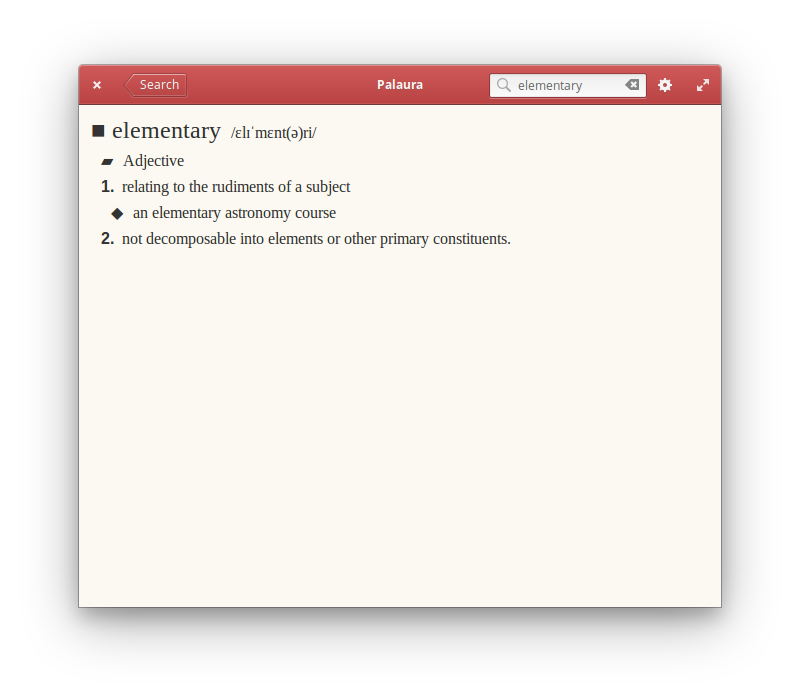

#  Palaura

## Find any word's definition with this handy dictionary

[](https://appcenter.elementary.io/com.github.lainsce.palaura)

[](https://travis-ci.org/lainsce/palaura)
[](http://www.gnu.org/licenses/gpl-3.0)



## Donations

Would you like to support the development of this app to new heights? Then:

[Be my backer on Patreon](https://www.patreon.com/lainsce)

## Dependencies

Please make sure you have these dependencies first before building.

```bash
granite
gtk+-3.0
meson
libsoup2.4
libjson-glib
```

## Building

Simply clone this repo, then:

```bash
meson build && cd build
meson configure -Dprefix=/usr
sudo ninja install
```

## Miscellanea

Uses the Oxford API for definitions and lookups.
